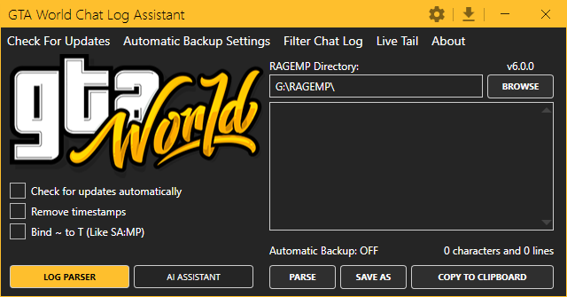

# GTA World Chat Log Assistant

This program converts the chat logs generated while playing on GTA World into readable text.



## Getting Started

No installation is required. Download the latest [release](https://github.com/BadassBaboon/GTAW-Log-Parser/releases) and run the executable.

Two flavours are published for each app:

| Suffix | Size | Requirements |
|---|---|---|
| `*-fdd-win-x64.exe` (framework-dependent) | ~5–10 MB | [.NET 8 Desktop Runtime](https://dotnet.microsoft.com/download/dotnet/8.0) must be installed |
| `*-selfcontained-win-x64.exe` | ~80–100 MB | No runtime install needed |

If you have the .NET 8 Desktop Runtime (most users on a modern Windows do), the framework-dependent build is recommended.

## Optional: crash reporting

Set the `GTAW_SENTRY_DSN` environment variable to a Sentry DSN to enable opt-in crash reporting. Leave it unset (default) and nothing is sent.

```powershell
[Environment]::SetEnvironmentVariable("GTAW_SENTRY_DSN", "https://your-dsn@oXXXXX.ingest.sentry.io/YYYYY", "User")
```

Logs are always written to `%LocalAppData%\GTAW-Log-Parser\logs\` regardless of Sentry.

## Building from source

Requires the [.NET 8 SDK](https://dotnet.microsoft.com/download/dotnet/8.0).

```bash
# Build everything (Parser, Assistant, Shared, Shared.Tests)
dotnet build GTAW-Log-Parser.sln

# Run tests
dotnet test Shared.Tests/Shared.Tests.csproj

# Run Parser locally
dotnet run --project Parser

# Run Assistant locally
dotnet run --project Assistant
```

The solution uses SDK-style csproj. No special MSBuild flags are required.

## Publishing release binaries

The `.github/workflows/release.yml` workflow does this automatically on tag push (`git tag v6.0.0 && git push --tags`). To reproduce locally:

```bash
# Framework-dependent (small)
dotnet publish Assistant/Assistant.csproj -c Release -r win-x64 --self-contained false -p:PublishSingleFile=true

# Self-contained (no runtime needed on target machine)
dotnet publish Assistant/Assistant.csproj -c Release -r win-x64 --self-contained true -p:PublishSingleFile=true -p:IncludeNativeLibrariesForSelfExtract=true
```

Output: `Assistant/bin/Release/net8.0-windows/win-x64/publish/GTAWAssistant.exe`.

## Code signing (optional)

Released EXEs trigger Windows SmartScreen warnings unless code-signed. For OSS projects, two options:

- **[SignPath.io](https://signpath.io/foss)** — free Authenticode signing for OSS via GitHub Actions. Apply once, then sign every release.
- **Commercial cert** — buy a certificate from a CA (DigiCert, Sectigo, GlobalSign) for ~$200–600/year and sign with `signtool.exe` in the release workflow.

Neither is wired up by default — both produce trust-warning-free downloads but require an external account.

## Contributing

1. Fork the project (<https://github.com/BadassBaboon/GTAW-Log-Parser>)
2. Create a branch (`git checkout -b feature/your-feature`)
3. Commit (`git commit -am "Add feature_name"`)
4. Push (`git push origin feature/your-feature`)
5. Open a pull request

CI builds and runs tests on every PR.

## Project structure

```
Parser/         — WinForms minimal parser (ParserMini.exe)
Assistant/      — WPF full-featured app with backup, filtering, themes (GTAWAssistant.exe)
Shared/         — Class library: ChatLogParser, ChatLogScanner, LocalizationController, Logging
Shared.Tests/   — xUnit tests for Shared/
```

## License

Distributed under the GPLv3 license. See `LICENSE` for more information.
