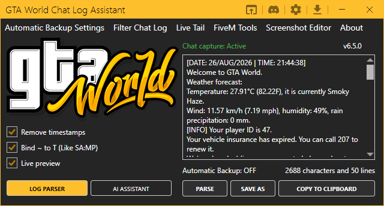

# GTA World Chat Log Assistant

A desktop program for GTA World on FiveM that reads in-game chat, removes timestamps, creates automated session backups, filters chat logs, and configures FiveM settings.



## Features

- **Live FiveM Chat Capture**: Reads the active GTA World NUI chat in real time while playing.
- **Timestamp Toggle**: Strips `[HH:mm:ss]` timestamps on demand or keeps them for evidence and logs.
- **Automated Backups**: Saves timestamped chat logs to your chosen directory whenever the game closes or on a set interval.
- **Chat Log Filter**: Filters lines by character speech (IC), out-of-character chat (OOC), private messages (PM), radio transmissions, emotes, actions, advertisements, or specific player names.
- **Live Tail**: Streams chat lines live as they appear in-game with auto-scrolling.
- **FiveM Tools**: Adjusts first-person driving FOV (`cam_vehicleFirstPersonFOV`), injects ReShade hardware keys into `CitizenFX.ini`, clears server cache, and resets corrupted graphic settings.
- **Desktop Quick Launch**: Creates a desktop shortcut to start the assistant and connect directly to `fivem.gta.world`.
- **In-App Updater and Rollback**: Checks for GitHub releases, updates executables directly, and allows one-click rollback to the previous version.

## Download

Download the latest version from the [Releases page](https://github.com/BadassBaboon/GTAW-Log-Parser/releases).

| Build | File size | Requirements |
|---|---|---|
| Framework-dependent (`*-fdd-win-x64.exe`) | ~5 to 10 MB | Requires [.NET 8 Desktop Runtime](https://dotnet.microsoft.com/download/dotnet/8.0) |
| Self-contained (`*-selfcontained-win-x64.exe`) | ~80 to 100 MB | None (runs out of the box) |

## Community

Join the Discord server for support, updates, and discussion: [Baboon's Workshop](https://discord.gg/qRdVSkUW6n).

## Building from Source

Requires the [.NET 8 SDK](https://dotnet.microsoft.com/download/dotnet/8.0).

### Build and Test

```bash
# Build the entire solution
dotnet build GTAW-Log-Parser.sln

# Run unit tests
dotnet test Shared.Tests/Shared.Tests.csproj
```

### Publish Binaries

```bash
# Publish framework-dependent executable (smaller file size)
dotnet publish Assistant/Assistant.csproj -c Release -r win-x64 --self-contained false -p:PublishSingleFile=true

# Publish self-contained executable (includes .NET runtime)
dotnet publish Assistant/Assistant.csproj -c Release -r win-x64 --self-contained true -p:PublishSingleFile=true -p:IncludeNativeLibrariesForSelfExtract=true
```

Published binaries output to `Assistant/bin/Release/net8.0-windows/win-x64/publish/GTAWAssistant.exe`.

For the lightweight WinForms Mini Parser, replace `Assistant/Assistant.csproj` with `Parser/Parser.csproj`.

## License

Distributed under the GNU General Public License v3.0. See [LICENSE](LICENSE) for details.
